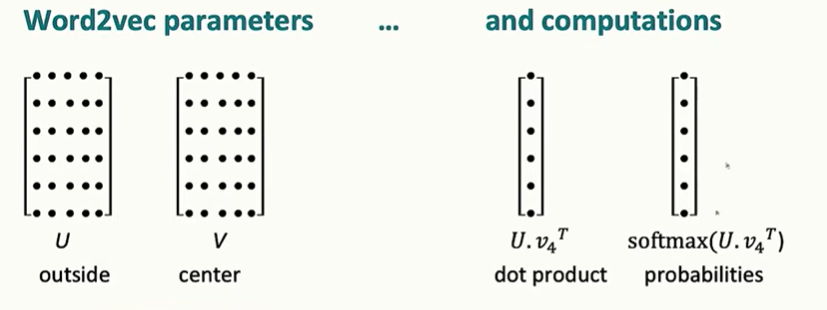
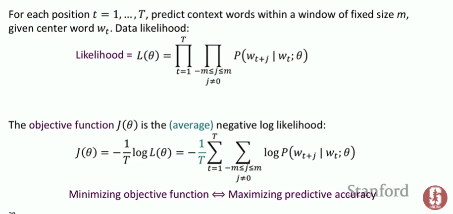

# 1강. Word Vector와 Word2Vec


## 1. 인간의 언어와 NLP

인간의 언어는 단순히 정보를 전달하는 수단이 아니라 복잡한 사고와 추론을 가능하게 한다. 하지만 자연어에는 **문맥, 중의성, 뉘앙스, 감정** 등이 포함되어 있기 때문에 컴퓨터가 의미를 정확히 이해하기 어렵다.

따라서 NLP(Natural Language Processing)에서는 인간의 언어를 컴퓨터가 처리할 수 있도록 **숫자 형태로 표현하는 방법**이 중요하다.

## 2. 단어의 의미

언어학적으로 단어는 **기표(Signifier)**와 **기의(Signified)**의 관계로 생각할 수 있다.

예를 들어 `tree`라는 문자열 자체는 기표이고, 우리가 떠올리는 나무의 개념은 기의에 해당한다.

컴퓨터에게 `tree`는 단순한 문자열이므로, NLP에서는 **단어의 의미를 어떻게 숫자로 표현할 것인가**가 핵심 문제이다.

## 3. WordNet


WordNet은 사람이 직접 단어들의 의미 관계를 정의하는 방식이다.

- 동의어(Synonym)
- 상위어(Hypernym)
- 하위어(Hyponym)

예:

`animal → mammal → dog`

### 한계

- 사람이 직접 구축해야 한다.
- 새로운 단어에 대응하기 어렵다.
- 미묘한 의미 차이나 문맥에 따른 의미 변화를 표현하기 어렵다.
- 계산에 활용하기 좋은 연속적인 숫자 표현이 아니다.

이러한 한계를 해결하기 위해 **단어를 Vector로 표현하는 방법**이 등장한다.

## 4. One-hot Vector

각 단어를 하나의 위치만 1이고 나머지는 0인 Vector로 표현한다.

```text
king  = [1, 0, 0, 0]
queen = [0, 1, 0, 0]
man   = [0, 0, 1, 0]
woman = [0, 0, 0, 1]
```

### 한계

`king`과 `queen`은 의미적으로 유사하지만 One-hot Vector에서는 서로 완전히 다른 Vector이다.

즉,

- 단어 간 **의미적 유사성을 표현하기 어렵다.**
- 단어가 많아질수록 Vector 차원이 매우 커진다.
- 대부분 값이 0인 **Sparse Vector**가 된다.

## 5. 분포 의미론

> **비슷한 문맥에 등장하는 단어는 비슷한 의미를 가진다.**

예:

```text
I drink coffee every morning.
I drink tea every morning.
```

`coffee`와 `tea`는 비슷한 주변 단어와 함께 등장한다. 따라서 두 단어는 의미적으로도 유사할 가능성이 높다.

이러한 아이디어가 Word2Vec의 기본적인 배경이 된다.

## 6. Word2Vec




Word2Vec은 대량의 텍스트 데이터인 **Corpus**를 이용하여 Word Embedding을 학습하는 방법이다.

예:

```text
problems turning into banking crises as
                      ↑
                   center
```

중심 단어가 `banking`이라면 주변 단어들을 Context Word로 사용한다.

Word2Vec에는 단어마다 두 종류의 Vector가 존재한다.

- Center Word Vector: `v`
- Outside/Context Word Vector: `u`

중심 단어 `c`와 주변 단어 `o`가 있을 때 두 Vector의 **내적 `uₒ · vᶜ`**을 계산한다.

내적값이 클수록 두 단어가 서로 관련될 가능성이 높다고 본다.

## 7. Softmax와 Word2Vec 학습




Word2Vec은 중심 단어가 주어졌을 때 주변 단어가 나타날 확률을 계산한다.

Softmax는 다음 역할을 한다.

1. `exp`를 이용하여 값을 양수로 만든다.
2. 전체 합으로 나누어 확률의 합을 1로 만든다.
3. 모든 후보 단어에 대한 확률분포를 생성한다.

학습 과정은 다음과 같다.

`Word Vector → 내적 → Softmax → 확률 → Loss → Gradient → Word Vector 수정 → 반복`

초기 Word Vector는 임의의 작은 값으로 시작하며, Corpus를 반복해서 보면서 예측이 정확해지도록 Vector가 수정된다.
