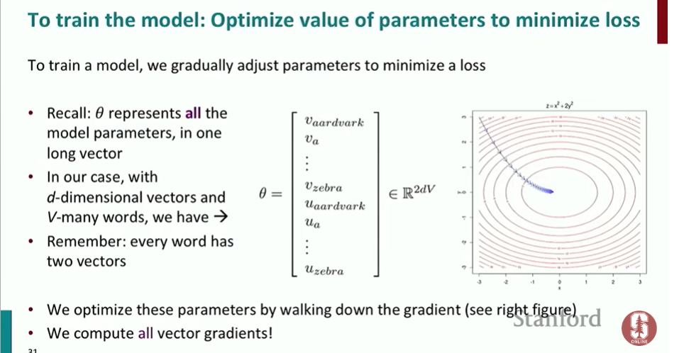
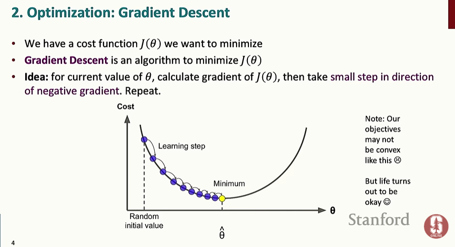
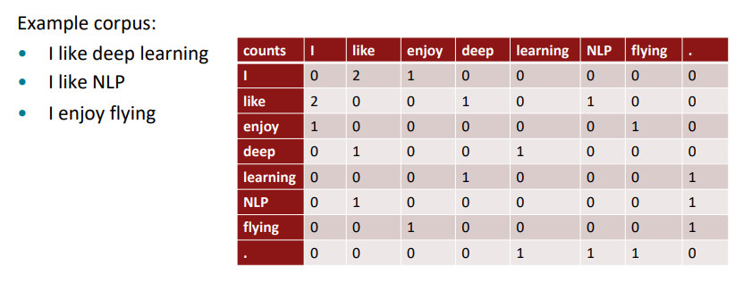
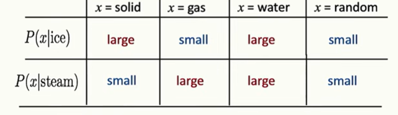
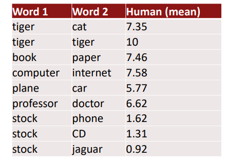

# 2강. Word Vector 학습과 GloVe

## 1. Gradient Descent




Gradient Descent는 **Loss를 최소화하도록 Parameter를 수정하는 방법**이다.

Gradient는 현재 위치에서 Loss가 가장 빠르게 증가하는 방향을 나타낸다. 따라서 Loss를 감소시키려면 **Gradient의 반대 방향**으로 이동한다.

```text
θ_new = θ_old - α∇J(θ)
```

- `θ`: 학습할 Parameter
- `J(θ)`: Loss Function
- `∇J(θ)`: Gradient
- `α`: Learning Rate

### Learning Rate

학습률은 한 번의 Update에서 Parameter를 얼마나 이동시킬지를 결정한다.

- 너무 크면 → 최솟값을 지나치거나 발산할 수 있음
- 너무 작으면 → 학습 속도가 매우 느려짐

## 2. Stochastic Gradient Descent (SGD)




전체 Corpus가 매우 크면 모든 데이터를 사용해 Gradient를 한 번 계산하는 데 시간이 오래 걸린다.

SGD는 전체 데이터 대신 **일부 데이터를 이용하여 Gradient를 계산하고 바로 Parameter를 Update**한다.

일부 데이터만 사용하므로 Gradient에 Noise가 존재하지만 계산이 훨씬 빠르다.

실제 Deep Learning에서는 여러 Sample을 묶어 사용하는 **Mini-batch SGD**가 일반적이다.

## 3. Skip-gram과 CBOW


Word2Vec의 대표적인 두 가지 학습 방식이다.

| 방식 | 입력 | 예측 |
| --- | --- | --- |
| Skip-gram | 중심 단어 | 주변 단어 |
| CBOW | 주변 단어 | 중심 단어 |

### Skip-gram

```text
I like deep learning very much
       ↑
     center
```

`deep`이 주어졌을 때 `like`, `learning` 등의 주변 단어를 예측한다.

### CBOW

```text
I like [ ? ] learning
```

주변 단어 `like`, `learning` 등을 이용해 중심 단어 `deep`을 예측한다.

## 4. Negative Sampling


기존 Softmax의 가장 큰 문제는 Vocabulary가 매우 클 경우 **모든 단어에 대해 값을 계산해야 한다는 것**이다.

Negative Sampling에서는 모든 단어를 비교하지 않고 다음만 사용한다.

- 실제 문맥에 등장한 단어 → **Positive Sample**
- 무작위로 선택한 단어 → **Negative Sample**

예:

```text
coffee → drink      Positive
coffee → computer   Negative
coffee → car        Negative
coffee → mountain   Negative
```

실제 조합에는 높은 점수를, 가짜 조합에는 낮은 점수를 주도록 학습한다.

이때 Sigmoid를 이용해 각 Pair가 실제 문맥 관계일 확률을 계산한다.

### Unigram Distribution

단순히 단어 빈도에 비례해 Negative Sample을 선택하면 `the`, `a` 같은 고빈도 단어가 지나치게 많이 선택된다.

이를 완화하기 위해 Word2Vec에서는 **단어 빈도의 3/4승**을 사용한다.

## 5. Co-occurrence Matrix




Word2Vec과 달리 단어들이 **Corpus에서 얼마나 자주 함께 등장하는지 직접 세는 방법**이다.

행과 열에 단어를 두고 함께 등장한 횟수를 저장한다.

### 한계

- Vocabulary가 커질수록 행렬의 차원이 매우 커진다.
- 대부분의 값이 0인 **Sparse Matrix**가 된다.
- 저장과 계산 비용이 커진다.

따라서 차원을 줄이기 위해 SVD를 사용할 수 있다.

## 6. SVD를 이용한 차원 축소

SVD(Singular Value Decomposition)는 Co-occurrence Matrix가 가진 정보를 압축하여 **낮은 차원의 Dense Vector**로 표현한다.

즉,

`큰 Co-occurrence Matrix → 중요한 정보 추출 → 작은 Word Vector`

형태로 생각할 수 있다.

## 7. GloVe




GloVe(Global Vectors for Word Representation)는 **Corpus 전체의 Co-occurrence 통계**를 이용하여 Word Vector를 학습한다.

예를 들어 다음과 같은 관계가 Corpus의 동시출현 확률에 나타날 수 있다.

```text
ice   ↔ solid
steam ↔ gas
```

GloVe는 이러한 **동시출현 확률과 비율에 포함된 의미 관계**를 Vector에 반영한다.

### Word2Vec과 GloVe 비교

**Word2Vec**
- 주변 단어를 예측하면서 Vector 학습
- Local Context 중심

**GloVe**
- Corpus 전체의 Co-occurrence 통계 이용
- Global Statistics 활용

두 방법 모두 최종적으로는 단어의 의미를 **Dense Vector**로 표현한다.

## 8. Word Vector 평가




### Intrinsic Evaluation

Word Vector 자체의 품질을 평가한다.

대표적인 방법은 단어 Analogies이다.

```text
man : woman
king : ?
```

`queen`이 가까운 Vector로 나타나는지 확인한다.

또한 사람이 판단한 단어 유사도와 Vector가 계산한 유사도가 얼마나 비슷한지도 평가할 수 있다.

### Extrinsic Evaluation

Word Vector를 실제 NLP Task에 넣어보고 **최종 Task의 성능이 향상되는지** 평가한다.

## 9. Word Sense


하나의 단어가 여러 의미를 가질 수 있다.

예:

```text
bank → 금융기관
bank → 강둑
```

기존 Word2Vec은 기본적으로 하나의 단어에 하나의 Vector를 사용한다. 따라서 여러 의미가 하나의 Vector에 섞여 들어갈 수 있다.

이를 해결하기 위한 방법 중 하나는 문맥을 Clustering하여 서로 다른 Word Sense를 별도로 표현하는 것이다.

## 10. NLP Classification과 Window Classification

Word Vector는 실제 NLP Classification 문제에도 사용된다.

대표적인 예가 **NER(Named Entity Recognition)**이다.

```text
Chris Manning lives in Palo Alto.
```

- `Chris Manning` → PERSON
- `Palo Alto` → LOCATION

단어 하나만 보는 것보다 **주변 문맥(Window)**을 함께 보면 의미를 더 정확하게 판단할 수 있다.

하지만 단순한 Linear Classifier는 단어와 문맥 사이의 복잡한 **비선형 관계**를 표현하는 데 한계가 있다.

따라서 Neural Network를 사용한다.
