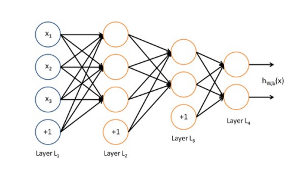
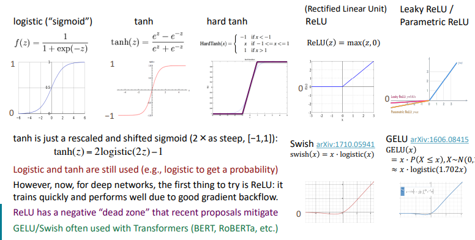
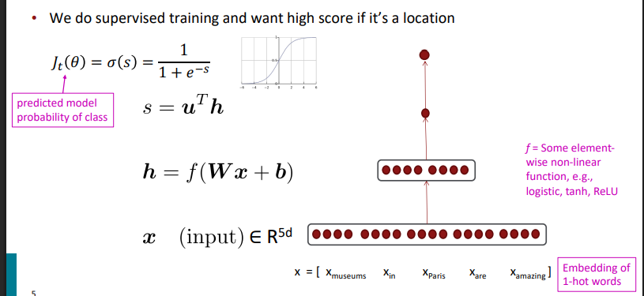
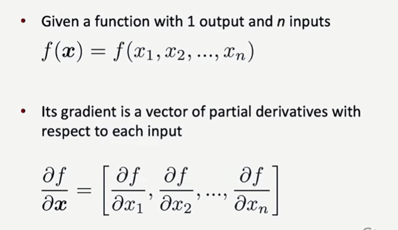
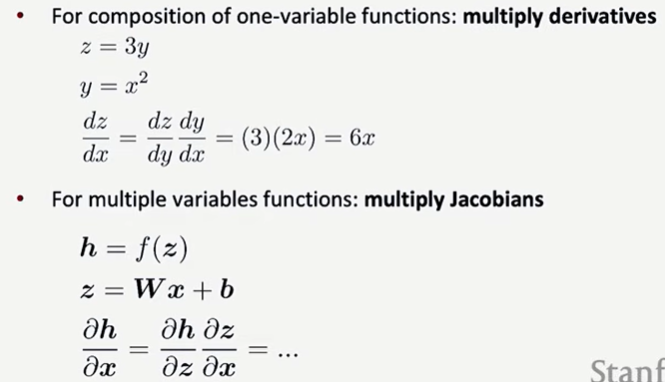
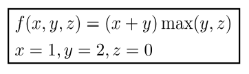
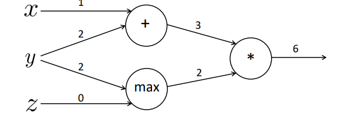
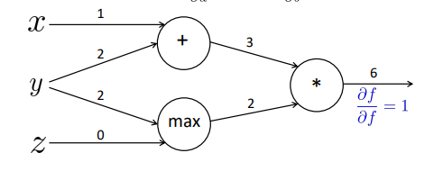
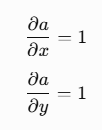
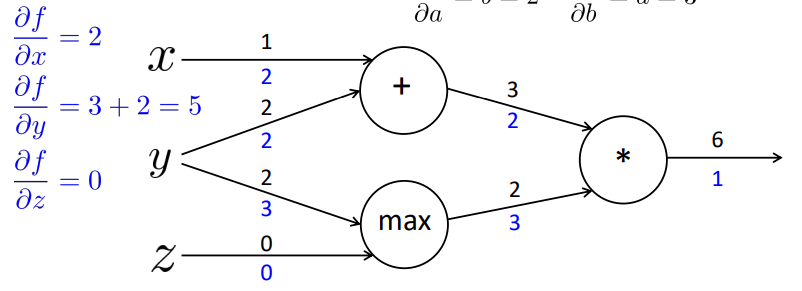

# 3강. Neural Network와 Backpropagation

## 1. Neural Network가 필요한 이유




Word Vector는 단어를 숫자로 표현하지만, 실제 NLP에서는 이를 이용하여 다음과 같은 문제를 해결해야 한다.

- 감성 분석
- 개체명 인식
- 문맥 분류

전체 흐름은 다음과 같다.

`Word Vector → Neural Network → Classification`

Neural Network는 여러 Layer와 비선형 함수를 이용해 입력 데이터를 반복적으로 변환하면서 복잡한 패턴을 학습한다.

## 2. Neural Network 기본 구조

기본적인 구조는 다음과 같다.

`Input Layer → Hidden Layer → Output Layer`

하나의 뉴런에서는 다음 계산을 수행한다.

```text
z = Wx + b
a = f(z)
```

- `x`: Input Vector
- `W`: Weight Matrix
- `b`: Bias
- `z`: Weighted Sum
- `f`: Activation Function
- `a`: Activation / Output

## 3. Activation Function




Activation Function은 Neural Network에 **Non-linearity(비선형성)**를 추가한다.

활성화 함수가 없다면 Linear Layer를 여러 개 쌓아도 결국 하나의 Linear Transformation과 같은 형태가 된다.

대표적인 함수는 다음과 같다.

| 함수 | 특징 |
| --- | --- |
| Sigmoid | 0~1 출력, 확률 표현 등에 사용 |
| tanh | -1~1 출력 |
| ReLU | `max(0,z)`, Deep Network에서 널리 사용 |
| Leaky ReLU | ReLU의 음수 영역 문제 완화 |
| GELU / Swish | Transformer 계열 등에서 사용 |

## 4. Neural Network를 이용한 NER

문장에서 중심 단어 주변의 Word Embedding을 연결(Concatenate)하여 Input Vector `x`를 만든다.

Hidden Representation:

```text
h = f(Wx + b)
```

Score:

```text
s = uᵀh
```

이후 Sigmoid를 적용하여 중심 단어가 Location인지 아닌지와 같은 확률을 계산할 수 있다.

전체 흐름:

`Word Embeddings → Input x → Hidden h → Score s → Sigmoid → Probability`

## 5. Feedforward Neural Network




Feedforward는 정보가 **Input → Hidden → Output 방향으로 전달되는 과정**이다.

현재 Parameter를 이용하여 실제 예측값을 계산한다.

```text
Input x
↓
z = Wx + b
↓
h = f(z)
↓
Output Score
↓
Prediction
↓
Loss
```

Neural Network에서는 여러 뉴런의 계산을 하나씩 수행하는 대신 **행렬 연산으로 한 번에 처리**하여 효율성을 높인다.

## 6. Loss Function과 Parameter Update

Loss Function은 모델의 예측값과 실제 정답이 얼마나 다른지 측정한다.

학습의 목표는 **Loss를 최소화하는 Parameter를 찾는 것**이다.

SGD의 Parameter Update:

```text
θ_new = θ_old - α∇J(θ)
```

Deep Learning에서는 `W`, `b`뿐 아니라 **Word Vector도 학습 가능한 Parameter**가 될 수 있다.

## 7. Gradient

Gradient는 입력값을 조금 변화시켰을 때 출력값이 얼마나 변화하는지를 나타낸다.

입력 변수가 여러 개라면 각 변수에 대해 **Partial Derivative(편미분)**를 계산한다.

### Jacobian Matrix

출력이 여러 개 존재하는 경우 모든 입력과 출력 사이의 편미분을 행렬로 표현한 것이 Jacobian이다.

- Gradient → 하나의 출력에 대한 여러 입력의 변화량
- Jacobian → 여러 출력과 여러 입력 사이의 변화량

## 8. Chain Rule




Neural Network에서는 여러 함수가 연속적으로 연결된다.

```text
x → z → h → J
```

이때 `x`가 최종 Loss `J`에 미치는 영향은 Chain Rule을 이용하여 계산한다.

```text
∂J/∂x = (∂J/∂h)(∂h/∂z)(∂z/∂x)
```

Chain Rule은 Backpropagation의 핵심 원리이다.

## 9. Backpropagation




먼저 Forward Propagation으로 Prediction과 Loss를 계산한다.

**Forward**

`Input → Hidden → Output → Loss`

그 다음 Loss에서 시작해 신경망을 뒤로 이동하면서 각 Parameter의 Gradient를 계산한다.

**Backward**

`Input ← Hidden ← Output ← Loss`

각 Node에서는 다음 관계가 사용된다.

`Downstream Gradient = Upstream Gradient × Local Gradient`

- **Upstream Gradient**: 뒤쪽 Layer에서 전달받은 Gradient
- **Local Gradient**: 현재 Node 자체의 미분
- **Downstream Gradient**: 앞쪽 Node로 전달하는 Gradient

## 10. Backpropagation이 효율적인 이유


각 Parameter의 Gradient를 처음부터 따로 계산하면 동일한 미분 계산을 반복해야 한다.

Backpropagation은 이미 계산한 Gradient를 재사용한다.

```text
Forward 계산
↓
중간값 저장
↓
Backward
↓
계산된 Gradient 재사용
↓
모든 Parameter의 Gradient 계산
```

따라서 모든 Parameter의 Gradient를 효율적으로 계산할 수 있다.

## 11. Backpropagation 계산 예제






함수:

```text
f(x,y,z) = (x+y) × max(y,z)
```

주어진 값:

```text
x = 1
y = 2
z = 0
```

### Forward Propagation

**Step 1. 덧셈**

```text
a = x + y
  = 1 + 2
  = 3
```

**Step 2. Max**

```text
b = max(y,z)
  = max(2,0)
  = 2
```

**Step 3. 곱셈**

```text
f = a × b
  = 3 × 2
  = 6
```

따라서 최종 출력은 `f = 6`이다.

### Backward Propagation

최종 출력에서 시작한다.

```text
∂f/∂f = 1
```

#### 곱셈 Node




`f = a × b`이므로:

```text
∂f/∂a = b = 2
∂f/∂b = a = 3
```

Multiply Gate에서는 **상대편 입력값이 Local Gradient**가 된다.

#### 덧셈 Node

`a = x + y`이므로 각 입력에 대한 Local Gradient는 1이다.

```text
x Gradient = 2 × 1 = 2
y Gradient = 2 × 1 = 2
```

Add Gate는 전달받은 Gradient를 그대로 각 입력으로 전달한다.

#### Max Node




`b = max(y,z)`에서 Forward 시 `y=2`가 선택되었다.

따라서:

```text
y의 Local Gradient = 1
z의 Local Gradient = 0
```

Upstream Gradient가 3이므로:

```text
y Gradient = 3 × 1 = 3
z Gradient = 3 × 0 = 0
```

#### Branch에서 Gradient 합산




`y`는 두 경로에서 동시에 사용되었다.

- Add 경로 → Gradient `2`
- Max 경로 → Gradient `3`

따라서:

```text
∂f/∂x = 2
∂f/∂y = 2 + 3 = 5
∂f/∂z = 0
```

하나의 변수가 여러 Branch로 나뉘어 사용되었다면 **Backward에서는 각 Branch에서 전달된 Gradient를 모두 합산**한다.

## 12. Computational Graph와 학습 흐름

Computational Graph는 복잡한 Neural Network의 계산을 Node와 연결 관계로 표현한다.

전체 학습 과정:

`Forward → Prediction → Loss → Backpropagation → Gradient 계산 → Weight Update → 반복`

Forward에서는 각 Node의 출력값을 계산하고, Backward에서는 Local Gradient를 이용하여 Gradient를 반대 방향으로 전달한다.

## 13. Word Vector Fine-tuning

Word Vector 역시 Neural Network의 학습 가능한 Parameter로 설정할 수 있다.

```text
Word Vector
↓
Neural Network
↓
Prediction
↓
Loss
↓
Backpropagation
↓
Word Vector Update
```

따라서 특정 NLP Task에 맞게 **Word Vector 자체도 함께 수정(Fine-tuning)**될 수 있다.

## 14. Automatic Differentiation

실제 Deep Learning에서는 개발자가 모든 미분을 직접 계산하지 않는다.

PyTorch 등의 Framework는 다음 과정을 자동으로 수행한다.

`Forward → Computational Graph → Loss → Backward → Gradient 자동 계산`

즉, Backpropagation은 PyTorch 등의 **Automatic Differentiation(자동 미분)**이 동작하는 핵심 원리이다.

## 15. Numerical Gradient Checking

Backpropagation으로 계산한 Gradient가 올바른지 확인하기 위한 방법이다.

작은 `h`를 이용하여 미분값을 근사한다.

```text
f'(x) ≈ [f(x+h) - f(x-h)] / 2h
```

일반적으로 매우 작은 `h ≈ 10⁻⁴`를 사용한다.

Backpropagation으로 계산한 Gradient와 Numerical Gradient가 거의 같다면 구현이 올바르다고 판단할 수 있다.

### 한계

- Parameter마다 반복 계산해야 하므로 매우 느리다.
- 정확한 미분이 아니라 근삿값이다.

따라서 실제 학습이 아니라 **Gradient 구현을 확인하는 Debugging 용도**로 사용한다.


# 전체 흐름 정리

```text
자연어
↓
단어의 의미를 숫자로 표현
↓
Word Vector
↓
Word2Vec / GloVe
↓
NLP Classification
↓
Neural Network
↓
Forward Propagation
↓
Prediction
↓
Loss
↓
Backpropagation
↓
Gradient 계산
↓
Parameter / Word Vector Update
↓
반복 학습
```

## 핵심 포인트

1. **분포 의미론**: 비슷한 문맥에 등장하는 단어는 비슷한 의미를 가진다.
2. **Word2Vec**: 주변 단어를 예측하면서 Word Vector를 학습한다.
3. **GloVe**: Corpus 전체의 Co-occurrence 통계를 활용해 Word Vector를 학습한다.
4. **Neural Network**: 비선형 관계를 학습하여 Word Vector를 실제 NLP Task에 활용한다.
5. **Backpropagation**: Chain Rule을 이용하여 Loss에서 각 Parameter까지 Gradient를 전달한다.
6. **Gradient Descent/SGD**: 계산된 Gradient를 이용해 Loss가 감소하는 방향으로 Parameter를 Update한다.
7. **Fine-tuning**: Neural Network의 Weight뿐 아니라 Word Vector 자체도 Task에 맞게 함께 학습할 수 있다.
