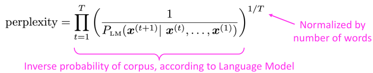

# 2주차

주제: Lecture 4,5,6 - Dependency Parsing / Recurrent Neural Networks / Sequence to Sequence Models and Machine Translation
날짜: 2026년 9월 30일 → 2026년 10월 6일
과제 제출일: 2026년 10월 6일
과제: https://web.stanford.edu/class/cs224n/assignments_w26/a2.pdf

# Lecture 6 - Sequence to Sequence Models and Machine Translation

# Recap

<aside>

- 언어모델(Language Model): 다음 단어를 예측하는 모델
- 순환 신경망(Recurrent Neural Network, RNN)
    - 특정 길이 순차적 입력 → 각 단계 동일한 가중치 적용 → 각 단계에서 선택적으로 출력 가능
- 순환 신경망 ≠ 언어모델
- 언어 모델링: NLP 작업의 전통적 하위 구성요소
    - 텍스트 생성, 텍스트 확률 추정과 관련
    - n-gram, transformers 등 다양한 모델로 수행 가능
</aside>

# 언어모델 평가 방법

- 언어모델이 텍스트에 점수를 매겨 그게 얼마나 가능성 높은지 알려주는 것
- 그때 사용되는 기준: **혼잡도(perlexity)**

### 혼잡도 perplexity

<aside>

</aside>

→ `perplexity = exp(J(θ))`

- 언어모델에 의한 corpus의 역수, 단어수로 정규화 → 평균
    
    $$
    P_{LM}(\underbrace{x^{(t+1)}}_{\text{맞혀야 할 다음 단어}} \mid \underbrace{x^{(t)},\dots,x^{(1)}}_{\text{지금까지 본 단어들}})
    $$
    
    - 앞 단어들을 보고 다음 단어를 예측했을 때, **정답 단어에 모델이 매긴 확률**
    - 구체적 예시
        
        문장 - "나는 오늘 학교에"
        실제 다음 단어 - "갔다"
        
        모델은 앞 단어들을 보고 어휘 사전 전체에 대해 확률분포를 출력함
        
        | 후보 단어 | 모델이 매긴 확률 |
        | --- | --- |
        | 갔다 | 0.40 |
        | 간다 | 0.25 |
        | 왔다 | 0.15 |
        | 먹었다 | 0.001 |
        | ...(나머지 단어들) | ... |
        
        이 분포에서 **실제 정답인 "갔다"의 확률인 0.40이** `P_LM`
        다른 후보의 확률은 이 식에 쓰이지 않고, 정답 단어의 확률만 뽑아 씀
        
        t를 1부터 T까지 옮겨가며 이 과정을 반복함
        
        - t=1: "나는" → 다음 단어 "오늘"의 확률
        - t=2: "나는 오늘" → 다음 단어 "학교에"의 확률
        - t=3: "나는 오늘 학교에" → 다음 단어 "갔다"의 확률
        
        이렇게 구한 확률들의 역수를 곱하고 `1/T` 제곱(기하평균)을 취한 것이 퍼플렉서티
        
- 혼잡도 = 교차 엔트로피의 지수적 증가
- 혼잡도가 낮을수록 좋음
    - 확률이 **높을수록**(모델이 정답을 잘 맞힐수록) 역수가 작아져서 혼잡도가 **낮아짐**
    - 확률이 **낮으면**(정답이 나올 줄 몰랐다면) 역수가 커져서 혼잡도가 **높아짐**
    
    ](Week2-images/image%202.png)
    
    출처: [https://research.fb.com/building-an-efficient-neural-language-model-over-a-billion-words/](https://research.fb.com/building-an-efficient-neural-language-model-over-a-billion-words/)
    

# 1. RNN의 문제

## 기울기 소실(Vanishing Gradients)

- 손실 함수: -log(likelihood) → 시퀀스 → 역전파 → 기울기 계산
    - 손실을 역전파 하면?
    - 매 timestep마다 연쇄법칙 적용

- 기울기 소실 문제: 표시된 값이 작다면, 역전파를 통해 시퀀스를 따라가며 값이 점점 작아지다가 소멸함

### 원인

1. RNN 은닉상태 식
    
    
    
    현재 은닉 상태 = 활성화 함수 σ(이전 은닉상태+현재 입력)
    
2. σ가 항등함수라면? (σ(x) = x)
    
    
    
    h^(t)를 h^(t-1)에 대해 편미분
    
3. RNN을 따라 역전파를 반복

### 결론

- 모든 고유값이 < 1인 경우, 지수가 커질수록 W_h값은 작아짐

→ W_h가 "작다"면(고유값의 크기가 1보다 작으면), **W_h^ℓ은 ℓ이 커질수록 지수적으로 0에 가까워짐**

### 기울기 소실이 문제인 이유

- 멀리 떨어진 곳에서 오는 gradient 신호는 가까운  gradient 신호보다 작기 때문에 사라짐
- 모델 가중치 업데이트 시, 장기적 영향이 아니라 단기적 영향에 의해 업데이트 됨

→ 기울기 소실로 인해 RNN은 **단기 의존성(short-term dependency)만 학습하고, 장기 의존성(long-term dependency)은 학습하지 못함**

## 기울기 폭발(Exploding Gradients)

### 기울기 폭발이 문제인 이유

- 행렬의 고유값이 커짐 → 기울기가 커짐 → 매개변수를 크게 업데이트
    
    ⇒ 잘못된 업데이트 발생 가능
    
    
    
    - 기울기 방향으로 너무 큰 방향으로 나아가면 잘못된 곳으로 갈 수 있음

## 기울기 소실&폭발 해결 방법

### 기울기 폭발 해결방법

**gradient clipping**

: 기울기의 노름(norm) 계산
→ norm이 기준보다 크면, 모든 방향으로 크기를 줄이고 더 작은 그래디언트를 업데이트함

### 기울기 소실 해결 방법

- 핵심 문제: RNN이 여러 단계에 걸쳐 정보를 효과적으로 보존하지 못하고 있음
- 바닐라 RNN에서 은닉상태가 완전히 새로 쓰여지고 있음
    
    
    
- 정보를 쉽게 저장할 수 있는 메모리를 가진 RNN을 설계하자
    - 다른 아키텍처를 사용해 메모리를 추가 ⇒ **LSTM 탄생**

# 2. Long Short-Term Memory RNN (LSTMs)

> 장-단기기억 RNN
> 

### 구조

- 입력 시퀀스: `x^(t)`
- 은닉 상태: `h^(t)`
- 셀 상태: `c^(t)`
- gate(게이트)
    - 입력, 은닉상태, 셀상태 업데이트 방식 조절
    - 벡터, 0~1 확률
    - 장치를 켜거나 끌 수 있음
- cell: 장단기 기억, 은닉 상태 정보 저장 → 세대 형성

- 잠재적 업데이트 사항
    
    
    
    이전 단계 은닉상태 + 새로운 input + 편향
    
- 실제 셀 업데이트
    
    
    
    이전에 배운 내용 중 기억해야 할 것 + 새로운 잠재적 업데이트를 얼마나 반영할 것인지
    
- 새로운 은닉 상태
    
    
    
    출력 게이트⊙tanh(셀 업데이트)
    

### LSTM 시각화

다른 단어를 예측하는 출력 레이어

### LSTM이 기울기 소실 문제를 해결하는 이유

- 셀 내에서 여러 시간 간격에 걸쳐 정보를 보존하기 때문!
    - eg) forget gate = 1, input gate = 0 → cell 내에서 동일한 정보를 무한히 전달

### 기울기 소실/폭발이 RNN만의 문제인가?

- 아님! 모든 신경 아키텍처에서 문제가 될 수 있음
    - 긴 시퀀스, 깊은 신경망일 수록 더 빠르고 신하게 발생
    - 심층 신경망에서 기울기 소실 발생 → 하위 레이어: 기울기 신호 거의 얻을 수 X → 모델 하위 레이어 학습 X → 네트워크 제대로 작동 X

**다른 해결법: 직접 연결 추가**

1. ResNet(Residual connections)
    1. skip-connection: 정보를 다음 레이어로 직접 전달
    
    ](Week2-images/image%2019.png)
    
    출처: [https://arxiv.org/pdf/1512.03385.pdf](https://arxiv.org/pdf/1512.03385.pdf)
    
2. Dense Net(Dense connections)
    1. 각 층을 모든 층에 직접 연결
        
        
        
3. HighwayNet(Highway connections)
    1. 입력값을 신경망 레이어의 출력값과 직접 합산하는 대신, 게이트를 통해 입력값 중 얼마나 많은 부분을 건너뛸지 결정
    2. 게이트용 residual networds 사용
        
        
        

# 3. RNN의 다른 사용 예시

1. 시퀀스 태깅
    1. 단어-품사 연결, named entity recognition
2. 문장 인코더 모델
    1. 문맥 분류(긍정or부정)
        1. 최종 은닉 상태를 사용하거나 or 모든 은닉층의 평균 또는 요소별 최댓값 사용
3. 다른 정보에 기반한 텍스트 생성
    1. 음성 인식, 기계 번역, 요약
        1. **조건부 언어모델**: 특정 정보 소스에 따라 언어를 생성하는 모델

# 4. 양방향 및 다층 RNNs(Bidirectional and Multi-layer RNNs)

## motivation

- 표시된 은닉상태: “terribly”라는 단어의 표현
    
    →  맥락적 표현(contextual representation)이라고 부름
    
- 맥락적 표현은 “terribly”의 왼쪽 context 정보만 포함하고 있음
    - 오른쪽 맥락도 확인하고 싶음

→ **양방향 LSTM 탄생**

## 양방향 RNNs (Bidirectional RNNs)

1. 순방향 RSTM
2. 역방향 RSTM
- 이제 “terribly”의 문맥적 표현이 왼쪽과 오른쪽의 맥락을 모두 가질 수 있음

### 특징

1. 양방향 RNN은 전체 입력을 볼 수 있는 상황에서만 쓸 수 있다.
2. 언어 분석은 잘함
3. 텍스트 생성에는 적합하지 않음

# 다층 RNN(Multi-layer RNNs, )

- 은닉 상태를 여러층으로 쌓아서 더 깊은 신경망을 만들 수 있음, RNN을 여러 개 쌓는 것
- stacked RNNs이라고도 불림

**특징**

- 다층 RNN은 더 복잡한 표현을 계산할 수 있음
- RNN은 2~4층 정도로 쌓는 것이 효과적이고, 더 깊게 쌓으려면 스킵/밀집 연결이 필요
- Transformer는 이런 연결 덕분에 12~24층까지 깊어짐

# 5. 기계번역 Machine Translation (MT)

기계 번역: source language → target language

## **통계적 기계 번역**

원문이 주어졌을 때 번역 결과가 나올 확률 학습

- 원문이 주어졌을 때 번역문이 나올 확률 = (1/번역문이 주어졌을 때 원문이 나올 확률)*번역문이 나올 확률

문제: 문장의 수식 관계를 제대로 포착하지 못하고 활용하지 못함

## 신경망 기계 번역

단일 end to end 신경망 → 신경기계번역 시스템 구축

신경망 아키텍처: 순차적 모델(sequence-to-sequence model)

- LSTM 2개 사용
- 1개: 원문(소스 문장) 인코딩 → 1개: 목표문장 생성

- Encoder RNN: 소스 문장의 인코딩 형태&은닉상태 구축
- Decoder RNN: 이전 은닉상태 입력, 목표문장 생성

## 기계 신경망 번역 시스템 학습

각 위치에서 예측 손실 계산 → 평균 손실 계산 → 단일 시스템에서 역전파

## 다층 심층 인코더-디코더 기계 번역 신경망(Multi-layer deep encoder-decoder machine translation net)

다층 LSTM 모델 → 성능 향상에 good
